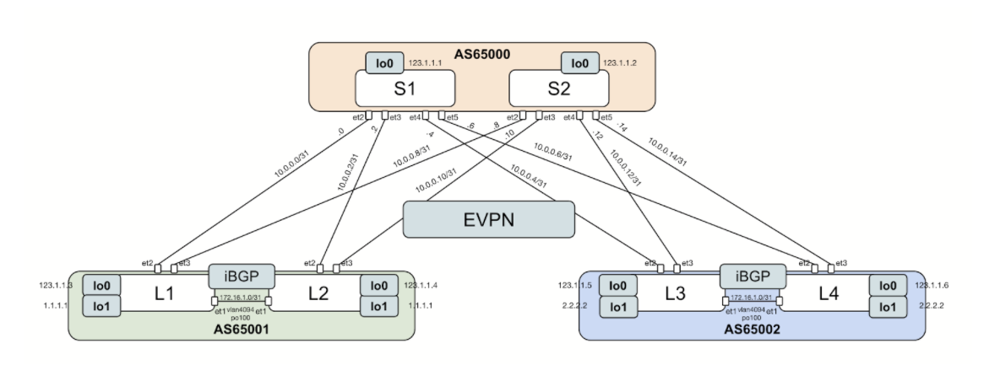
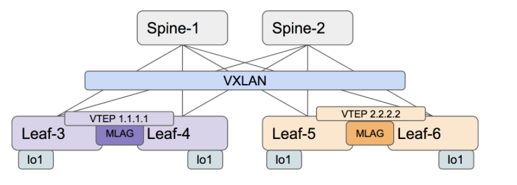
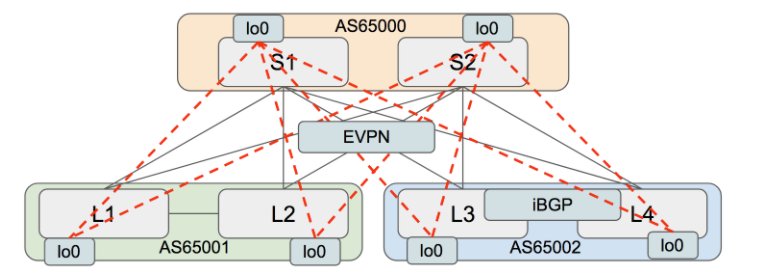

# Lab Guide - Day-1 - EVPN Infrastructure

## Lab topology



## Notes about this lab

* This is not a “push-command” lab (except for IP addresses config. Or some basic stuff)
  * Try the commands
  * It could have some basic missing and traps
  * The goal is not to finish absolutely but more for understanding
  * Lab will be available
* **Save on each box the initial-configurations for later-purposes**
  * `copy running-configuration flash:init_conf_ADC.eos`
* Don’t forget to save your running-configuration frequently.
  * `copy running-configuration startup-configuration`
  * `wr`
* If you don’t finish the lab :
  * don’t worry about it
  * We will use pre-configured stuff for the next labs

## ADC initial configurations

* Use this if you are going to start from here.
* Copy all these configurations to the boxes.

## EVPN Configuration steps

1. Underlay view

2. Peerings between Leaf and Spine switches should use physical interface IP
   1. On spines
      1. Configure ecmp : max paths 2, ecmp 2
      2. Configure a peer-filter leaf-range : name => leaf-range
      3. Configure a peer group to make the config : name => underlay-leaf-sessions
      4. Associate neighbor to peer group
      5. Use “bgp listen range”
      6. Disable default IPv4 unicast address-family in global BGP configuration
      7. Activate IPv4 session on peer group (address-family)
   2. On leafs
      1. Configure ecmp : max paths 2, ecmp 2
      2. Configure a peer-filter leaf-range : name => spine-range
      3. Configure a peer group to make the config : name => underlay-spine-sessions
      4. Associate neighbor to peer group
      5. Use “bgp listen range”
      6. Disable default IPv4 unicast address-family in global BGP configuration
      7. Activate IPv4 session on peer group (address-family)
   3. Check BGP session between Spine and Leaf
3. Configure iBGP over the peer link (leaf only)
   1. Use a peer group : mlag-ipv4-underlay-peer
   2. Associate the mlag-peer to the peer-group
   3. Use MLAG peer-link VLAN
      1. (Shutdown the iBGP session) 
      2. (more preferable in vEOS-lab)
4. Advertise VTEP reachability
   1. Advertise all loopbacks (lo0 and lo1) to BGP using route-map
      1. Create  : ip prefix-list loopback … and route-map loopback ...
      2. In the BGP conf. : redistribute connected route-map loopback
   2. Verify if the IPv4 underlay sessions are up and loopback are reachable
      1. `show ip route`
      2. `ping`
5. Configure VXLAN
   1. Enable interface `vxlan 1` and set the source interface to loopback 1
6. Configure eBGP - EVPN for overlay
   1. Schema

   2. Use peer group to complete config
      1. Disable maximum-routes
      2. Set the update-source
      3. Peer using the loopback0 interface
   3. On Spine switches use bgp listen range
   4. Don’t forget the EVPN bgp session are “multi-hop”
   5. Don’t forget the community
   6. Don’t forget that the spines in a route-server
   7. Don’t forget to activate the right address-familly
   8. Don’t forget that EVPN require ArBGP enable
7. Verify if the EVPN sessions are up

## Usefull example

* Interface vxlan

``` interface Vxlan1
   vxlan source-interface Loopback1
   vxlan udp-port 4789
```

* BGP

``` router bgp 65000
   router-id 123.1.1.2
   no bgp default ipv4-unicast
   maximum-paths 2 ecmp 2
   bgp listen range 123.0.0.0/8 peer-group overlay-leaf-sessions peer-filter leaf-range
   bgp listen range 10.0.0.0/8 peer-group underlay-leaf-sessions peer-filter leaf-range
   neighbor overlay-leaf-sessions peer group
   neighbor overlay-leaf-sessions update-source Loopback0
   neighbor overlay-leaf-sessions ebgp-multihop 3
   neighbor overlay-leaf-sessions send-community extended
   neighbor overlay-leaf-sessions maximum-routes 0
   neighbor underlay-leaf-sessions peer group
   neighbor underlay-leaf-sessions maximum-routes 12000
   neighbor underlay-leaf-sessions send-community
   redistribute connected route-map loopback
   !
   address-family evpn
      bgp next-hop-unchanged
      neighbor overlay-leaf-sessions activate
   !
   address-family ipv4
      neighbor underlay-leaf-sessions activate
```

* Access list

```ip prefix-list loopback seq 10 permit 123.1.1.0/24 le 32
ip prefix-list loopback seq 20 permit 1.1.1.1/32
```

## Ip adressing scheme

<table>
  <tr>
   <td><strong>Device</strong>
   </td>
   <td><strong>Interface</strong>
   </td>
   <td><strong>IP</strong>
   </td>
  </tr>
  <tr>
   <td><strong>spine1</strong>
   </td>
   <td><strong>ma1</strong>
   </td>
   <td><strong>192.168.0.10</strong>
   </td>
  </tr>
  <tr>
   <td>spine1
   </td>
   <td>et2
   </td>
   <td>10.0.0.0/31
   </td>
  </tr>
  <tr>
   <td>spine1
   </td>
   <td>et3
   </td>
   <td>10.0.0.2/31
   </td>
  </tr>
  <tr>
   <td>spine1
   </td>
   <td>et4
   </td>
   <td>10.0.0.4/31
   </td>
  </tr>
  <tr>
   <td>spine1
   </td>
   <td>et5
   </td>
   <td>10.0.0.6/31
   </td>
  </tr>
  <tr>
   <td>spine1
   </td>
   <td>lo0
   </td>
   <td>123.1.1.1/32
   </td>
  </tr>
  <tr>
   <td><strong>spine2</strong>
   </td>
   <td><strong>ma1</strong>
   </td>
   <td><strong>192.168.0.11</strong>
   </td>
  </tr>
  <tr>
   <td>spine2
   </td>
   <td>et1
   </td>
   <td>172.16.1.0/31
   </td>
  </tr>
  <tr>
   <td>spine2
   </td>
   <td>et2
   </td>
   <td>10.0.0.8/31
   </td>
  </tr>
  <tr>
   <td>spine2
   </td>
   <td>et3
   </td>
   <td>10.0.0.10/31
   </td>
  </tr>
  <tr>
   <td>spine2
   </td>
   <td>et4
   </td>
   <td>10.0.0.12/31
   </td>
  </tr>
  <tr>
   <td>spine2
   </td>
   <td>et5
   </td>
   <td>10.0.0.14/31
   </td>
  </tr>
  <tr>
   <td>spine2
   </td>
   <td>lo0
   </td>
   <td>123.1.1.2/32
   </td>
  </tr>
  <tr>
   <td><strong>leaf1</strong>
   </td>
   <td><strong>ma1</strong>
   </td>
   <td><strong>192.168.0.14</strong>
   </td>
  </tr>
  <tr>
   <td>leaf1
   </td>
   <td>et1
   </td>
   <td>172.16.1.0/31
   </td>
  </tr>
  <tr>
   <td>leaf1
   </td>
   <td>et2
   </td>
   <td>10.0.0.1/31
   </td>
  </tr>
  <tr>
   <td>leaf1
   </td>
   <td>et3
   </td>
   <td>10.0.0.9/31
   </td>
  </tr>
  <tr>
   <td>leaf1
   </td>
   <td>lo0
   </td>
   <td>123.1.1.3/32
   </td>
  </tr>
  <tr>
   <td>leaf1
   </td>
   <td>lo1
   </td>
   <td>1.1.1.1/32
   </td>
  </tr>
  <tr>
   <td><strong>leaf2</strong>
   </td>
   <td><strong>ma1</strong>
   </td>
   <td><strong>192.168.0.15</strong>
   </td>
  </tr>
  <tr>
   <td>leaf2
   </td>
   <td>et1
   </td>
   <td>172.16.1.1/31
   </td>
  </tr>
  <tr>
   <td>leaf2
   </td>
   <td>et2
   </td>
   <td>10.0.0.3/31
   </td>
  </tr>
  <tr>
   <td>leaf2
   </td>
   <td>et3
   </td>
   <td>10.0.0.11/31
   </td>
  </tr>
  <tr>
   <td>leaf2
   </td>
   <td>lo0
   </td>
   <td>123.1.1.4/32
   </td>
  </tr>
  <tr>
   <td>leaf2
   </td>
   <td>lo1
   </td>
   <td>1.1.1.1/32
   </td>
  </tr>
  <tr>
   <td><strong>leaf3</strong>
   </td>
   <td><strong>ma1</strong>
   </td>
   <td><strong>192.168.0.16</strong>
   </td>
  </tr>
  <tr>
   <td>leaf3
   </td>
   <td>et1
   </td>
   <td>172.16.1.0/31
   </td>
  </tr>
  <tr>
   <td>leaf3
   </td>
   <td>et2
   </td>
   <td>10.0.0.5/31
   </td>
  </tr>
  <tr>
   <td>leaf3
   </td>
   <td>et3
   </td>
   <td>10.0.0.13/31
   </td>
  </tr>
  <tr>
   <td>leaf3
   </td>
   <td>lo0
   </td>
   <td>123.1.1.5/32
   </td>
  </tr>
  <tr>
   <td>leaf3
   </td>
   <td>lo1
   </td>
   <td>2.2.2.2/32
   </td>
  </tr>
  <tr>
   <td><strong>leaf4</strong>
   </td>
   <td><strong>ma1</strong>
   </td>
   <td><strong>192.168.0.17</strong>
   </td>
  </tr>
  <tr>
   <td>leaf4
   </td>
   <td>et1
   </td>
   <td>172.16.1.1/31
   </td>
  </tr>
  <tr>
   <td>leaf4
   </td>
   <td>et2
   </td>
   <td>10.0.0.7/31
   </td>
  </tr>
  <tr>
   <td>leaf4
   </td>
   <td>et3
   </td>
   <td>10.0.0.15/31
   </td>
  </tr>
  <tr>
   <td>leaf4
   </td>
   <td>lo0
   </td>
   <td>123.1.1.6/32
   </td>
  </tr>
  <tr>
   <td>leaf4
   </td>
   <td>lo1
   </td>
   <td>2.2.2.2/32
   </td>
  </tr>
</table>
