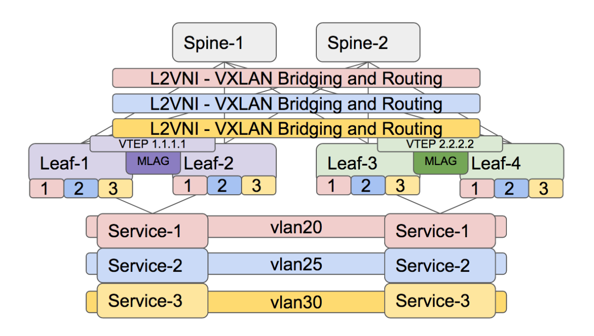

## Topology 

    

## Instructions  

This scenario is meant to be built on top of Scenario A.  

Configure VLAN and trunks  
- Use the diagram and do the VLAN and trunk config  

Configure VXLAN mappings  
- Configure VLAN-to-VNI mappings using the format VLAN = VNI  
- Verify the data-plane configuration  

Configure MAC-VRF  
- You use Vlan-based for VLAN 25  
- Vlan-based  
   - RD should be VTEP:VNI
   - RT should be VNI:VLAN
   - Redistribute learned MACs
- Vlan-aware bundle for 20 and 30
   - RD should be VTEP:2030
   - RT should be 2030:2030
   - Redistribute learned MACs
- Verify Type-3 exchange
- Verify BGP for Type-2 routes
- VLAN-aware bundle do we need ETID?
	
Configure IRB
- Based on the diagram enable the IRB
- Configure address virtual .254 on all
- Verify MAC+IP presence in EVPN
- Verify ARP/MAC table

Verify the following
- Host to host reachability within same VLAN
- Host to Gateway reachability
- Host to host reachability inter VLAN
- Do we have ECMP

## Examples (do not copy and paste): 

- VLAN-to-VNI mappings  
```
vlan 25 
!
interface Vxlan1
   vxlan vlan 25 vni 25
```
- IRB configuration 
```
ip virtual-router mac-address aaaa.bbbb.cccc
!
interface Vlan25
   ip address virtual 10.0.25.254/24
```
- Vlan-based service interface 
```
router bgp 65001
   vlan 25
  	rd 123.1.1.4:25
  	route-target both 25:25
  	redistribute learned
```
- Vlan-aware bundle service interface 
```
router bgp 65001
   vlan-aware-bundle vlan2030
  	rd 123.1.1.4:2030
  	route-target both 2030:2030
  	redistribute learned
  	vlan 20,30
```

