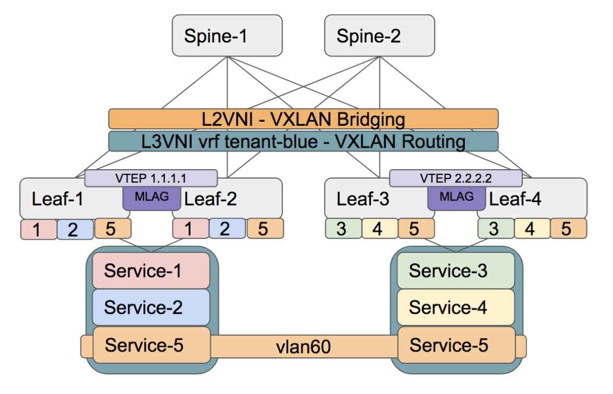

## Topology  

   

VLAN40 (S1) VLAN45 (S2) are only on VTEP 1.1.1.1  
VLAN50 (S3) VLAN55 (S4) are only on VTEP 2.2.2.2  
VLAN60 (S5) is stretched across all VTEPs with VNI to VLAN mapping  

## Instructions 

Configure VLAN and trunks
-   Use the diagram and do the VLAN and trunk config

Configure VXLAN mappings (VLAN/VRF)
-   Configure VLAN-to-VNI mappings using the format VLAN = VNI
-   Configure VRF-to-VNI mapping using the format tenant-blue = 12345
-   Verify the data-plane configuration

Configure MAC-VRFs
-   RD should be RID:VLAN
-   Redistribute learned MACs
-   Verify Type-3 exchange
-   Verify BGP for Type-2 routes

Configure IP-VRF
-   RD should be RID:VLAN
-   RT should be 12345:12345
-   Verify if we have Type-5 routes

Configure IRB
-   Assign interface to the tenant-blue vrf
-   Use virtual address with .254 on all
-   Verify EVPN for Type-5
-   Verify routing table for VRF tenant-blue
-   Verify ARP and MAC tables

Confirm the following
-   Reachability for the hosts in vlan 60
-   Verify inter VLAN reachability
-   Confirm if you can ping from Gateway?

Configure additional Lo223 locally
-   Use VRF tenant-blue
-   Assign unique IP address from 223.255.255.x/32
  - Where x = Leaf number
-   Try pinging and see if we use the Lo223  as a source when generating packets or replies.

## Examples (do not copy and paste): 

