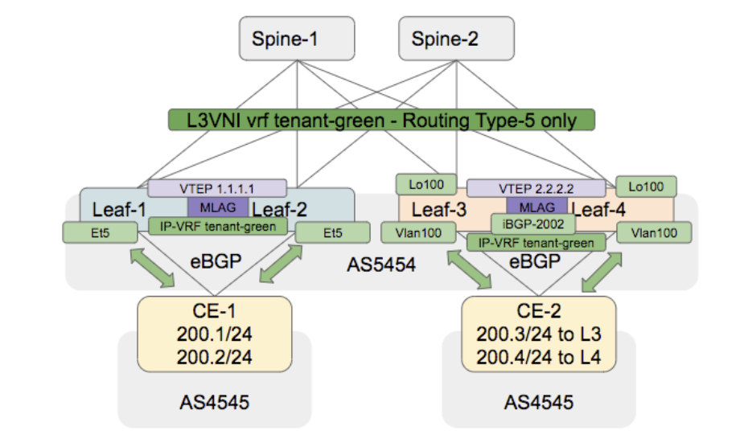

# Lab Guide - Day-3 - EVPN Infrastructure

## Lab topology

## Notes about this lab

* This is not a “push-command” lab (except for IP addresses config. Or some basic stuff)
  * Try the commands
  * It could have some basic missing and traps
  * The goal is not to finish absolutely but more for understanding
  * Lab will be available
* **If it is a new training session (different from day-1 and day-2) : Save on each box the initial-configurations for later-purposes**
  * `copy running-configuration flash:init_conf_ADC.eos`
* **If it is the same training session from day-1 and day-2 : Restore the initial configuration on Spine1, Spine2, Leaf1, Leaf2, Leaf3, Leaf4**
  * `Configuration replace flash:init_conf_ADC.eos`
* Don’t forget to save your running-configuration frequently.
  * `copy running-configuration startup-configuration`
  * or `wr`
* If you don’t finish the lab : 
  * don’t worry about it 
  * You’ll have the lab to practice later on

## ADC initial configurations

* Use this if you are going to start from day-1 only
* Copy to each devices the configurations localized in day-1/solutions

## L3VPN configuration

1. Overview

2. Side A - Leaf1-2 to CE-1 using P2P links
   1. Configure P2P link between both VTEPs and CE-1
      1. `vrf tenant-greeen`
      2. Use /31, CE already preconfigured
         1. 100.0.0.0 on Leaf1
         2. 100.0.0.2 on Leaf2
   2. Configure IP-VRF as per the diagram
      1. RD in format <VTEP_loopback_EVPN>:8888
      2. RT as 8888:8888
      3. Router_id as lo0
   3. Configure VXLAN VRF to VNI mapping
      1. Verify interface Vxlan1 for dynamic mapping
      2. Use show vlan dynamic and confirm
   4. Configure PE-CE routing
      1. Use P2P links for BGP peering
      2. CE uses ASN4545
      3. PE uses ASN5454 (no prepend)
      4. Check the bgp neighboring with CE
      5. Verify if the eBGP session is up within VRF and see if you get any message using 
         1. `show bgp neighbors vrf tenant-green for errors`
      6. Verify if we receive additional prefixes from our peer and see if RT-5 are present on leaf-1/leaf-2
      7. Confirm if prefixes are installed in VRF
3. Side B - Leaf3-4 to CE-2 using VLAN100 with SVI and participating in MLAG
   1. Configure VLAN2002 for reachability between Leaf3-4
      1. Verify the VLAN
      2. SVI for VLAN2002 should be in VRF tenant-green
      3. VLAN2002 has the following SVI
         1. Leaf 3 : 101.101.101.1/31
         2. Leaf 4 : 101.101.101.0/31
   2. Configure VLAN100 for reachability to CE-2
      1. SVI for VLAN100 should be in VRF tenant-green
      2. Configure SVI for VLAN100 with ip address virtual using 100.100.0.254/24 on both Leaf3-4
         1. CE-2 has 100.100.0.2/24 as IP and will be used for peering
      3. Don’t forget to check if vlan 100 is on the mlag po toward CE-2
   3. Configure loopback100 on both switches for BGP peering (in the right VRF)
      1. Leaf3 = 100.100.100.3
      2. Leaf4 = 100.100.100.4
   4. Configure ip-prefix list tenant-green-ibgp for redistributing CE-2 physical address connected to each PE 
      1. 100.100.100.3/24 on leaf-3
      2. 1. 100.100.100.4/24 on leaf-4
   5. Configure the route-map redistribute-tenant-green 
      1. PF : tenant-green-ibgp
   6. Configure ip-prefix list tenant-green for filtering route coming from CE-2
      1. 200.3.0.0/24 on leaf-3
      2. 200.4.0.0/24 on leaf-4
   7. Configure the route-map filter-tenant-green
      1. PF : tenant-green
   8. Configure VXLAN VRF to VNI mapping
      1. Verify interface Vxlan1 for dynamic mapping
      2. Use show vlan dynamic and confirm
   9. Configure IP-VRF 
      1. RD in format <VTEP_loopback_EVPN>:8888
      2. RT as 8888:8888
      3. Router_id as lo0
   10. Configure leaf-3/leaf-4 iBGP
       1. leaf-3 : neighbor 101.101.101.0
       2. leaf-4 : neighbor 101.101.101.1
       3. Activate the neighboring
       4. **Note : Is the next-hop-self required ? Why ?**
    1. Configure PE-CE routing
       1. CE uses ASN4545, leaf-3/leaf-4 should use local-asn 5454 (no-prepend)
       2. Configure the filtering of learning route from CE with the appropriate route-map
    2. Redistribute connected route with the appropriate route-map
    3. Verify if the iBGP session is up within VRF and see if you get any message using 
       1. show bgp neighbors vrf tenant-green for errors
       2. Check CE-2 show ip bgp summary vrf vlan100
       3. Verify if we receive additional prefixes from our peer and generate RT-5
       4. Confirm if prefixes are installed in VRF
       5. Verify reachability from all subnets on each host, if it works :)
          1. ping vrf vlan100

## Lab conventions

- Contain services, addressing scheme and conventions
- Located [here](lab-conventions.md)

## Ip adressing scheme

<table>
  <tr>
   <td><strong>Device</strong>
   </td>
   <td><strong>Interface</strong>
   </td>
   <td><strong>IP</strong>
   </td>
  </tr>
  <tr>
   <td><strong>spine1</strong>
   </td>
   <td><strong>ma1</strong>
   </td>
   <td><strong>192.168.0.10</strong>
   </td>
  </tr>
  <tr>
   <td>spine1
   </td>
   <td>et2
   </td>
   <td>10.0.0.0/31
   </td>
  </tr>
  <tr>
   <td>spine1
   </td>
   <td>et3
   </td>
   <td>10.0.0.2/31
   </td>
  </tr>
  <tr>
   <td>spine1
   </td>
   <td>et4
   </td>
   <td>10.0.0.4/31
   </td>
  </tr>
  <tr>
   <td>spine1
   </td>
   <td>et5
   </td>
   <td>10.0.0.6/31
   </td>
  </tr>
  <tr>
   <td>spine1
   </td>
   <td>lo0
   </td>
   <td>123.1.1.1/32
   </td>
  </tr>
  <tr>
   <td><strong>spine2</strong>
   </td>
   <td><strong>ma1</strong>
   </td>
   <td><strong>192.168.0.11</strong>
   </td>
  </tr>
  <tr>
   <td>spine2
   </td>
   <td>et1
   </td>
   <td>172.16.1.0/31
   </td>
  </tr>
  <tr>
   <td>spine2
   </td>
   <td>et2
   </td>
   <td>10.0.0.8/31
   </td>
  </tr>
  <tr>
   <td>spine2
   </td>
   <td>et3
   </td>
   <td>10.0.0.10/31
   </td>
  </tr>
  <tr>
   <td>spine2
   </td>
   <td>et4
   </td>
   <td>10.0.0.12/31
   </td>
  </tr>
  <tr>
   <td>spine2
   </td>
   <td>et5
   </td>
   <td>10.0.0.14/31
   </td>
  </tr>
  <tr>
   <td>spine2
   </td>
   <td>lo0
   </td>
   <td>123.1.1.2/32
   </td>
  </tr>
  <tr>
   <td><strong>leaf1</strong>
   </td>
   <td><strong>ma1</strong>
   </td>
   <td><strong>192.168.0.14</strong>
   </td>
  </tr>
  <tr>
   <td>leaf1
   </td>
   <td>et1
   </td>
   <td>172.16.1.0/31
   </td>
  </tr>
  <tr>
   <td>leaf1
   </td>
   <td>et2
   </td>
   <td>10.0.0.1/31
   </td>
  </tr>
  <tr>
   <td>leaf1
   </td>
   <td>et3
   </td>
   <td>10.0.0.9/31
   </td>
  </tr>
  <tr>
   <td>leaf1
   </td>
   <td>lo0
   </td>
   <td>123.1.1.3/32
   </td>
  </tr>
  <tr>
   <td>leaf1
   </td>
   <td>lo1
   </td>
   <td>1.1.1.1/32
   </td>
  </tr>
  <tr>
   <td><strong>leaf2</strong>
   </td>
   <td><strong>ma1</strong>
   </td>
   <td><strong>192.168.0.15</strong>
   </td>
  </tr>
  <tr>
   <td>leaf2
   </td>
   <td>et1
   </td>
   <td>172.16.1.1/31
   </td>
  </tr>
  <tr>
   <td>leaf2
   </td>
   <td>et2
   </td>
   <td>10.0.0.3/31
   </td>
  </tr>
  <tr>
   <td>leaf2
   </td>
   <td>et3
   </td>
   <td>10.0.0.11/31
   </td>
  </tr>
  <tr>
   <td>leaf2
   </td>
   <td>lo0
   </td>
   <td>123.1.1.4/32
   </td>
  </tr>
  <tr>
   <td>leaf2
   </td>
   <td>lo1
   </td>
   <td>1.1.1.1/32
   </td>
  </tr>
  <tr>
   <td><strong>leaf3</strong>
   </td>
   <td><strong>ma1</strong>
   </td>
   <td><strong>192.168.0.16</strong>
   </td>
  </tr>
  <tr>
   <td>leaf3
   </td>
   <td>et1
   </td>
   <td>172.16.1.0/31
   </td>
  </tr>
  <tr>
   <td>leaf3
   </td>
   <td>et2
   </td>
   <td>10.0.0.5/31
   </td>
  </tr>
  <tr>
   <td>leaf3
   </td>
   <td>et3
   </td>
   <td>10.0.0.13/31
   </td>
  </tr>
  <tr>
   <td>leaf3
   </td>
   <td>lo0
   </td>
   <td>123.1.1.5/32
   </td>
  </tr>
  <tr>
   <td>leaf3
   </td>
   <td>lo1
   </td>
   <td>2.2.2.2/32
   </td>
  </tr>
  <tr>
   <td><strong>leaf4</strong>
   </td>
   <td><strong>ma1</strong>
   </td>
   <td><strong>192.168.0.17</strong>
   </td>
  </tr>
  <tr>
   <td>leaf4
   </td>
   <td>et1
   </td>
   <td>172.16.1.1/31
   </td>
  </tr>
  <tr>
   <td>leaf4
   </td>
   <td>et2
   </td>
   <td>10.0.0.7/31
   </td>
  </tr>
  <tr>
   <td>leaf4
   </td>
   <td>et3
   </td>
   <td>10.0.0.15/31
   </td>
  </tr>
  <tr>
   <td>leaf4
   </td>
   <td>lo0
   </td>
   <td>123.1.1.6/32
   </td>
  </tr>
  <tr>
   <td>leaf4
   </td>
   <td>lo1
   </td>
   <td>2.2.2.2/32
   </td>
  </tr>
</table>